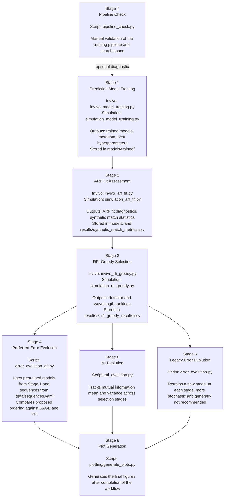

# Experiments Workflow

This document summarizes the recommended execution flow for the experiments in this repository. The overall process is the same for both the simulation and invivo datasets, while the concrete scripts differ by dataset. The workflow below is written as a methods-style overview so it can be reused in project documentation and manuscript preparation.

## Workflow Figure

## Recommended Process Flow

| Stage | Purpose | Invivo Script | Simulation Script | Main Outputs | Notes |
| --- | --- | --- | --- | --- | --- |
| 1. Prediction model training | Train the predictive model for a specified set of random seeds. Each seed defines a different data split and therefore produces a different trained model. Hyperparameters are tuned separately for each split. | `invivo_model_training.py` | `simulation_model_trraining.py` | `models/trained/*.pkl` and associated metadata | Stores the trained models together with the relevant metadata and best hyperparameters for each seed. These models are used later for stage-wise performance evaluation. |
| 2. ARF fit assessment | Fit and evaluate the ARF-based conditional density estimator to verify that the synthetic-data model is configured appropriately. | `invivo_arf_fit.py` | `simulation_arf_fit.py` | `models/` artifacts and `results/synthetic_match_metrics.csv` | This stage is diagnostic. The fitted ARF models are used to assess fit quality and hyperparameter adequacy, but they are not used later in the downstream selection workflow. |
| 3. RFI-greedy selection | Run greedy recursive feature inclusion over detector distances and wavelengths to produce the final selection order. | `invivo_rfi_greedy.py` | `simulation_rfi_greedy.py` | `results/invivo_rfi_greedy_results.csv`, `results/simulation_rfi_greedy_results.csv` | These results are later used to visualize stage-wise RFI behavior and to define the proposed acquisition sequence. |
| 4. Error evolution using fixed pretrained models | Evaluate predictive performance as the selected detector or wavelength set grows stage by stage, while unselected variables are replaced by their training-set mean so that they remain uninformative. | `error_evolution_alt.py` | `error_evolution_alt.py` | `results/error_evolution_alt.csv` and related config entries | This is the preferred error-evolution analysis. It uses the trained models from Stage 1 and compares the proposed ordering against SAGE, PFI, and any additional sequences listed in `data/sequences.yaml`. |
| 5. Legacy error evolution | Recompute model performance by training a new model at every stage using only the currently selected detectors or wavelengths. | `error_evolution.py` | `error_evolution.py` | `results/error_evolution.csv` | This is the older formulation. Because a new model is trained at each stage, the results are more stochastic and are generally not recommended for the main study. |
| 6. Mutual-information evolution | Evaluate the mean and variance of mutual information at each stage as an alternative way to compare selection strategies. | `mi_evolution.py` | `mi_evolution.py` | MI evolution outputs configured through the experiment settings | Useful as a complementary analysis to error evolution when comparing alternative detector and wavelength orderings. |
| 7. Pipeline sanity check | Verify that the predictive-model training pipeline and hyperparameter search space are behaving as expected. | `pipeline_check.py` | `pipeline_check.py` | Diagnostic outputs only | This is intended for manual validation and debugging of the training setup. It is not part of the main experimental flow. |
| 8. Plot generation | Produce the final figures once the relevant experiment stages for a given dataset have been completed. | `plotting/generate_plots.py` | `plotting/generate_plots.py` | Figures written to the configured output locations | Run this after completing the workflow for either the invivo or simulation study. |

## Stage Descriptions

### 1. Prediction Model Training

The workflow begins by training the prediction models used in the downstream analyses. For each dataset, the training script is executed over a predefined set of random seeds. Each seed induces a distinct data split and therefore produces a different trained model. Hyperparameter optimization is performed independently for each split, and both the trained model and the corresponding best hyperparameters are stored under `models/trained/` together with the associated metadata.

### 2. ARF-Based Conditional Density Estimation

The ARF fitting scripts are used to determine whether the conditional density estimator is well specified for the dataset under consideration. These runs generate ARF-based models and provide summary statistics that quantify how well the estimator matches the target distribution. The resulting diagnostics are recorded in `results/synthetic_match_metrics.csv`. These ARF models are used only for fit assessment and are not part of the later feature-selection pipeline.

### 3. Greedy RFI Sequence Construction

The main selection stage is carried out with the RFI-greedy scripts. These experiments generate a ranked sequence over both detector distances and wavelengths and write the results to dataset-specific CSV files in `results/`. The resulting ordering is the main output of the selection procedure and is later reused in the comparative analyses.

### 4. Stage-Wise Error Evolution With Fixed Models

The preferred error-evolution experiment is implemented in `error_evolution_alt.py`. At each stage, one additional detector or wavelength is incorporated into the active measurement set. All unselected variables are replaced with their training-set mean so that they contribute no useful information to the prediction. In this way, the performance at each stage depends only on the variables selected up to that point. This experiment compares the proposed sequence against SAGE, PFI, and any other candidate ordering defined in `data/sequences.yaml`.

### 5. Legacy Stage-Wise Error Evolution

The older `error_evolution.py` workflow retrains a new predictive model at every stage using only the currently selected detectors or wavelengths. Although this can still be informative, it introduces additional stochasticity and is therefore less suitable as the primary analysis.

### 6. Mutual-Information Evolution

The `mi_evolution.py` script provides an alternative stage-wise comparison based on the mean and variance of mutual information. This is useful when selection strategies need to be compared from an information-theoretic perspective rather than purely through downstream predictive error.

### 7. Pipeline Validation

The `pipeline_check.py` script is reserved for manual verification of the predictive-model training pipeline, especially when adjusting the hyperparameter search space used in Stage 1. It serves as a debugging and validation utility rather than a formal component of the experimental flow.

### 8. Figure Generation

Once the relevant runs have been completed for either dataset, the final figures can be generated through `plotting/generate_plots.py`.

## Script Reference

| Script | Role in the Workflow | Recommended Usage |
| --- | --- | --- |
| `invivo_model_training.py` | Seed-wise model training and hyperparameter tuning for invivo data | Run before any downstream invivo performance analysis that relies on pretrained models. |
| `simulation_model_trraining.py` | Seed-wise model training and hyperparameter tuning for simulation data | Run before any downstream simulation performance analysis that relies on pretrained models. |
| `invivo_arf_fit.py` | Diagnostic ARF fitting for invivo data | Use to evaluate conditional density fit quality and ARF hyperparameters. |
| `simulation_arf_fit.py` | Diagnostic ARF fitting for simulation data | Use to evaluate conditional density fit quality and ARF hyperparameters. |
| `invivo_rfi_greedy.py` | Main RFI-greedy selection for invivo data | Primary invivo feature-selection experiment. |
| `simulation_rfi_greedy.py` | Main RFI-greedy selection for simulation data | Primary simulation feature-selection experiment. |
| `error_evolution_alt.py` | Preferred stage-wise performance evaluation with fixed pretrained models | Use for the main comparative error-evolution analysis. |
| `error_evolution.py` | Legacy stage-wise performance evaluation with retraining at each stage | Use only if the older formulation is specifically required. |
| `mi_evolution.py` | Stage-wise mutual-information analysis | Use as a complementary comparison between candidate sequences. |
| `pipeline_check.py` | Manual pipeline and search-space verification | Use for development and debugging, not as part of the final reported workflow. |

